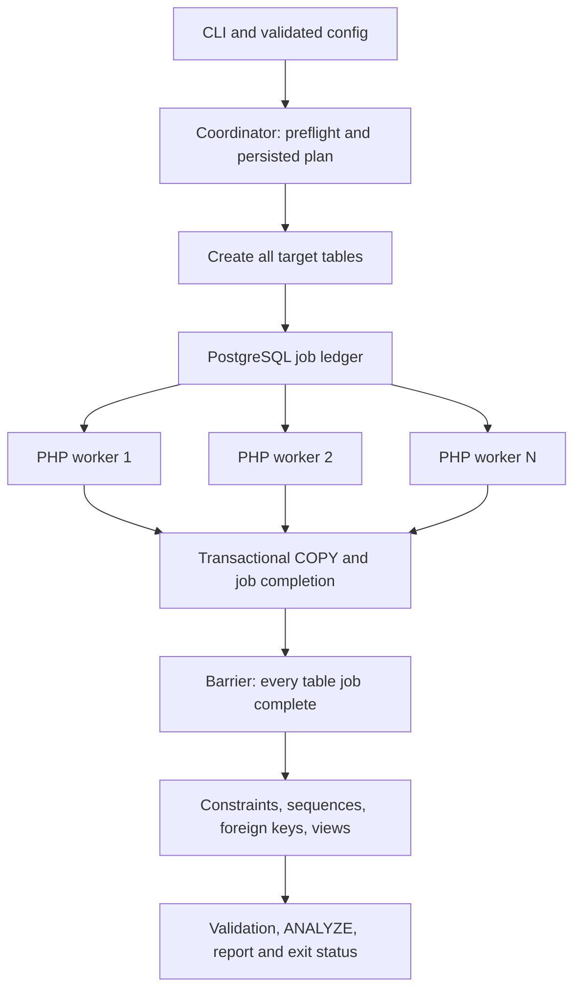

# PHP 8.5 and multiple-worker refactor plan

Prepared against this checkout on October 4, 2026. This is an implementation plan; application behavior has not been changed.

## Recommended direction

Keep this application a CLI database migration tool. First establish a correct, tested PHP 8.5 migration with one worker. Then introduce a coordinator and a bounded pool of independent PHP processes, initially assigning one table to each job. Keep PostgreSQL COPY as the data transport and use the target PostgreSQL database for durable job state. Redis, a message broker, an ORM, and a web application are unnecessary for the initial design.

The default remains one worker until correctness and resource benchmarks justify enabling more. Support `--workers=N`, with 2 and 4 workers as initial benchmark configurations. Parallelize data loading first; keep schema creation and finalization under one coordinator.

Assumptions: workers run on one host/container initially; the source is write-frozen or a restored immutable snapshot; the migration target is dedicated to the run. Migrating an actively changing source with CDC and distributed workers are separate projects.

## What the checkout currently contains

| Area | Evidence | Refactor consequence |
| --- | --- | --- |
| Runtime | `composer.json` requires `php: ^7.4`; Compose and `.devcontainer/Dockerfile` reference `php:8.5-cli`; README still says PHP 5.4 | Align runtime, dependencies, CI, and documentation rather than only changing the image |
| Dependency graph | HTTP/routing, Twig, Doctrine and container packages are required, but repository PHP code only imports Monolog from that graph; no committed `composer.lock` | Audit and remove unused runtime packages; resolve and lock the retained dependencies on PHP 8.5 |
| Execution | `FromMySqlToPostgreSql.php` is 1,566 lines; `createAndPopulateTables()` processes tables sequentially | Extract services before introducing process concurrency |
| Connections | `connect()` opens PDO MySQL, PDO PostgreSQL, and a separate ext-pgsql COPY connection; it disables synchronous commit | Make ownership explicit; put COPY and job completion in the same target transaction and restore durable commits by default |
| Testing | Two SQL fixtures; CI installs dependencies but its test step is commented out | Build automated assertions against real source/target databases |
| Containers | Compose uses the base PHP image rather than building the Dockerfile; Dockerfile omits `pgsql`, `mbstring`, and SimpleXML installation | Build one verified application image with all required extensions |
| Operations | Logs have fixed shared paths; failures are often logged and processing continues; final success can conceal rejected rows or failed DDL | Introduce run IDs, structured results, explicit failure policy, and reliable exit codes |

### Blockers to fix before measuring throughput

These are source-inspection findings, not runtime test results:

1. `Logs.php:32` calls `DIR(__FILE__, 2)` instead of `dirname(__FILE__, 2)`. Logging initialization cannot work as intended.
2. `populateTableData()` prepares its SELECT, fetches before execution, and has `execute()` commented out. It also passes `$arrSanitizedCsvData[]` as an argument to `implode`, which is invalid read syntax. Fix lint errors and statement execution before any baseline.
3. Its binary branch writes to `$arraySanitizedCsvData` instead of `$arrSanitizedCsvData`; `arrangeColumnsData()` does not perform the binary hex conversion assumed by that branch. Verify bytea encoding through a real COPY round trip.
4. `MapDataTypes::getMySqlPgSqlTypesMap()` continues into branches using an empty base type and `$arrDataType[1]` for unparameterized types. Rebuild parsing around a normalized type descriptor; fail explicitly on unsupported types.
5. `$Utility` and `$Log` are dynamic properties. Declare and inject them; dynamic property creation is deprecated from PHP 8.2. [PHP documentation](https://www.php.net/manual/en/migration82.deprecated.php)
6. `PDO::MYSQL_ATTR_USE_BUFFERED_QUERY` is deprecated in PHP 8.5. Use `Pdo\Mysql::ATTR_USE_BUFFERED_QUERY`, configured before executing the data SELECT. [PHP 8.5 deprecations](https://www.php.net/manual/en/migration85.deprecated.php)
7. `index.php` reads `$argv[1]` before checking it. JSON/XML normalization computes `$arrRetVal` but passes `$config`; XML remains an object while downstream code expects arrays. Normalize both formats into a validated configuration object.
8. Constructors return early with typed properties uninitialized. Replace partial initialization with preflight validation and exceptions handled at the CLI boundary.
9. Failed COPY batches fall back to row-by-row insertion, potentially committing partial data while the run later reports success. Default to failing the table transaction; any optional reject mode must explicitly mark the run incomplete.

## PHP 8.5 modernization

### Runtime and dependency policy

- Set Composer's PHP requirement to `~8.5.0` for an intentionally 8.5-only initial support contract. Test the actual deployed 8.5 patch version and update it through normal maintenance.
- Declare `ext-pdo`, `ext-pdo_mysql`, `ext-pgsql`, `ext-mbstring`, and `ext-simplexml`. Retain `ext-pdo_pgsql` while legacy PDO target code exists; remove it if the final target adapter only uses ext-pgsql. JSON is built into PHP 8.5.
- Remove unused Twig, Guzzle/PSR-7, League, Laminas, Doctrine, and Symfony error-handler dependencies after verifying no external entry point relies on them. Retain a PHP 8.5-compatible stable Monolog and PSR-3 interface. Avoid guessing exact tool versions: resolve supported stable PHPUnit, PHPStan, and coding-standard tooling under PHP 8.5 and commit `composer.lock`.
- Correct Composer metadata, including the placeholder description and the mismatch between `license: proprietary` and the GPL notices/`LICENSE.md`; verify provenance before changing license metadata.
- Build the image in Compose; pin tested database versions rather than `latest`/`lts` aliases. Use a verified Composer binary/image instead of the Dockerfile's stale installer checksum. Move the hardcoded database password into development environment configuration.
- Explicitly provision PHP 8.5 in CI, check extensions, run `composer validate --strict`, locked installation, `composer check-platform-reqs`, PHP lint, static analysis, and integration tests. Run dependency audit as a separate actionable check.
- Review all intervening PHP 8.0–8.5 migration guides, not just 8.5. Treat warnings/deprecations as failures in tests; audit extension return values and ext-pgsql object types (`PgSql\Connection`, `PgSql\Result`). [PHP migration guides](https://www.php.net/manual/en/appendices.php)

### Code and configuration

Use `declare(strict_types=1)`, explicit return types, constructor injection, readonly configuration/metadata objects, and enums for phases and job outcomes. Introduce these at tested boundaries; preserve database numeric values as strings when needed to avoid unsigned-bigint overflow and decimal precision loss.

Create a Composer-autoloaded `src/` tree. Keep `index.php` as a compatibility shim, using `__DIR__ . '/vendor/autoload.php'`, so invocation works from any directory. Add `bin/migrate` for the coordinator and an internal `bin/migration-worker` entry point. Proposed commands:

```text
php bin/migrate --config=config.json --workers=4
php bin/migrate --config=config.json --dry-run
php bin/migrate --config=config.json --resume=<run-id>
php index.php sample_config.json
```

The last command remains supported. JSON/XML legacy DSN strings go through an adapter with deprecation guidance; new config separates DSN and credentials, supports environment references, and validates encoding, schema, positive batch limits, worker count, and policies. Never put passwords in worker command arguments, job payloads, reports, or plan files. Use inherited environment or restricted local config access. Explicitly parse legacy `data_only` values rather than relying on string truthiness.

## Target architecture

| Component | Responsibility | Existing code to extract |
| --- | --- | --- |
| `ConfigLoader` / `MigrationConfig` | Parse, normalize, validate JSON/XML and CLI overrides | `index.php`, `setDefaults()` |
| `ConnectionFactory` | Open independent source/target sessions; configure timeouts, charset, error policy | `connect()` |
| `MySqlSchemaInspector` | Discover tables, columns, keys, views, engines, and source identity | `loadStructureToMigrate()`, metadata queries |
| `TypeMapper` / `RowTransformer` / `CopyTextEncoder` | Pure, testable mapping and lossless conversion | `MapDataTypes`, `arrangeColumnsData()`, `Utilities`, row loop |
| `SchemaPlanner` / `PostgresSchemaWriter` | Persist a deterministic DDL plan; execute and checkpoint schema phases | Table, constraint, sequence, FK, and view methods |
| `MigrationCoordinator` | Preflight, target lock, phase barriers, process lifecycle, final status | `migrate()`, `createAndPopulateTables()` |
| `JobRepository` | Durable run/job ledger and transactional claims | New |
| `TableMigrationWorker` / `CopyWriter` | Stream one table, COPY, verify, commit job result atomically | `populateTable()`, `populateTableData()`, `copySaveRows()` |
| `MigrationReporter` | Structured logs, live progress, final counts and errors | `Logs`, `generateReport()` |

Adapters own SQL execution; mapping and encoding do not own connections. Workers receive immutable planned metadata, rather than mutating the legacy migration object or re-running schema discovery while an unbuffered data cursor is open.



## Worker coordination and correctness

### Scheduling and phase order

1. Preflight connectivity, privileges, target collisions, extensions, supported types, source consistency, and config. `--dry-run` prints the DDL/job plan without creating schema or copying rows.
2. Persist a run ID, source/target identities, normalized nonsecret configuration hash, schema fingerprint, plan version, and job list in a separate target control schema such as `migration_control`.
3. Use two advisory lock keys scoped to target database/schema: a coordinator mutex and a target guard. The coordinator holds the mutex exclusively, obtains the guard exclusively before planning/DDL, then switches to a shared guard before launching workers while retaining the mutex. Every worker holds the shared guard for its lifetime. A replacement coordinator must obtain the mutex and then the exclusive guard, so surviving workers block new planning/DDL. Implement and test lock ordering and worker admission checks against the active run ID so coordinator crashes cannot admit stale workers into a replacement run.
4. Create all destination tables serially. Apply conversion-critical type/check definitions before loading; defer keys, FKs, sequence adjustment, and expensive indexes. Checkpoint each DDL phase transactionally where possible.
5. Enqueue one data job per table. Dispatch larger tables first using approximate metadata sizes, avoiding an obligatory full `COUNT(*)` pre-scan. Each table has at most one active data job.
6. Run up to N fresh PHP processes. Launch with `proc_open` argument arrays; open DB connections inside each process. Drain stdout/stderr continuously and bound retained output. Do not pass live PDO/pgsql handles between processes or require threads/fibers for blocking database work.
7. Wait for every required job to commit successfully before finalization. Create table-local constraints/indexes, adjust sequences, create and validate FKs, then create views in dependency order. Initially run these serially; later permit bounded index-building concurrency after measuring target resource pressure.
8. Validate data/schema, run `ANALYZE`, and publish the final run result. Any required data, DDL, or validation failure produces a nonzero exit and an incomplete run.

### Durable jobs and retries: initial implementation

Use target tables for runs and jobs, with uniqueness on `(run_id, table_id)` and fields for status, attempts, row counts, byte counts, duration, and sanitized error. The supervisor records attempts and retry backoff durably; live progress is emitted separately.

For each table job, on one ext-pgsql connection:

1. `BEGIN`; select an eligible pending job with `FOR UPDATE SKIP LOCKED` and deterministic ordering.
2. Keep that row lock until the table load finishes. Claim state inside this transaction is intentionally invisible to other sessions until commit; supervisor logs/progress identify active workers. An empty claim result does not imply the run is complete: jobs may still be locked by peers.
3. Stream source rows into the target using `COPY ... FROM STDIN` with an explicit ordered column list. Check transformation outcomes, COPY completion, and source-read/copied counts.
4. Update the same job row to `completed` and record verified counts, then `COMMIT` on that same connection.

PostgreSQL documents `SKIP LOCKED` as suitable for queue-like consumers. It should not be used to establish source-data consistency. [SELECT documentation](https://www.postgresql.org/docs/current/sql-select.html)

Process termination rolls back both the table data and the completion marker, releasing the claim. If the connection dies during COMMIT, reconnect and read the durable marker before retrying. This prevents a committed table from being copied twice within the run. The old split PDO/COPY transaction model cannot provide that guarantee.

Start with whole-table transactions: restart an interrupted table from its beginning. Streaming bounds PHP memory but does not reduce transaction size, WAL, or rollback costs. Set connection/statement timeouts appropriate to large tables and monitor disk/WAL usage. Avoid lease expiry while a worker still has permission to write; row-lock ownership is the initial design, with no lease protocol required.

Retry only classified transient failures with bounded attempts and backoff. Conversion failures, unsupported DDL, and constraint violations fail the run. After rollback, persist the failure/attempt result in a separate short transaction, with supervisor handling crashes where no result can be recorded. Resume must reconcile ledger state, validate plan/schema fingerprints, and re-acquire locks; never retry solely because a process exit status is missing.

### Source consistency

Independent MySQL worker transactions do not automatically share a snapshot. Require a verified operational write freeze (including DDL) or a restored immutable backup for the first release. Per-worker repeatable-read alone is insufficient for a globally consistent migration. Reject or explicitly require a best-effort override for an actively changing source; mark such output unverified. No automatic resume guarantee is possible after the source changes, so resume must require the same immutable source identity or renewed operator attestation, as well as fingerprints.

For nontransactional source tables, the same write-freeze/immutable-source requirement applies. Supporting coordinated snapshot establishment with brief global locks, replication positions, or CDC needs its own design and integration tests.

### Data-only and existing targets

Define data-only as append into explicitly selected existing tables; never silently truncate them. Verify exact column mappings and target constraints before loading. COPY batches and the completion marker remain in one table transaction. A completed job is not appended again on resume of the same run; a new run is a new append and requires explicit intent.

Existing immediate FKs can require parent-first loading. Initially schedule data-only jobs by FK dependency layers, using one worker if necessary; reject cycles that cannot be satisfied under the supported transaction policy. Do not disable triggers or bypass FKs as a default. Generated columns, target defaults, identity columns, triggers, uniqueness conflicts, and existing rows need explicit policy and fixtures. Abort safely on conflicts.

## Streaming and conversion policy

- Use an unbuffered MySQL data connection, with metadata discovered beforehand or queried through a different connection. Buffered queries retain results in PHP memory; unbuffered cursors impose restrictions on other queries on that connection. [PHP buffering documentation](https://www.php.net/manual/en/mysqlinfo.concepts.buffering.php)
- Distinguish COPY buffer size from schedulable jobs: the current `data_chunk_size` estimates rows from table/index size and is not table partitioning. Bound actual serialized bytes and row count, with explicit oversize-row handling and per-worker memory limits.
- Encode COPY text deliberately: NULL versus literal `\N`, tabs, newlines, carriage returns, backslashes, bytea hex, invalid encodings, empty strings, and column order. Parameterize values and quote identifiers with dedicated dialect-aware helpers. SQL identifiers cannot be supplied as value placeholders. [COPY documentation](https://www.postgresql.org/docs/current/sql-copy.html)
- Preserve numeric precision: map unsigned BIGINT to a suitable `NUMERIC(20,0)`, not signed BIGINT. Retain decimals as strings, and test signed/unsigned boundaries, bit widths, JSON, enum/set, fractional timestamps, and zero-date policy.
- Make zero-date and invalid-character handling configurable and report every conversion; preserve the legacy zero-date behavior only as a named policy. No silent skipping or guessed encodings.
- Make spatial migration an explicit PostGIS feature with SRID/type verification. MySQL geometry families do not automatically map to PostgreSQL native `point`/`line`/`polygon` types with equivalent semantics.
- Treat view conversion as supported syntax plus explicit unsupported reports. The current string substitution is not a general MySQL SQL translator. Required unsupported views fail validation; any optional view policy marks the report accordingly.
- Prefer identity columns for new schemas where mapping permits; finalize sequence state after data is committed. Handle empty tables, source AUTO_INCREMENT values above current MAX, and subsequent INSERT behavior.

### Later: parallel ranges within a large table

Add only after table-level workers are stable and benchmarks show one table dominates elapsed time. Use immutable, persisted nonoverlapping primary-key ranges with keyset predicates rather than LIMIT/OFFSET. Initially require a unique non-null integer key; tables with composite/string keys or no suitable key retain a single job. Preserve large keys as strings when necessary.

Each range COPY and its range completion marker must commit together. Choose between direct loads into the dedicated target table and isolated staging based on validation/publish needs. Never truncate a whole table to retry one range. Introduce a table-completion barrier before sequence/index/FK finalization, and test sparse keys, empty ranges, boundary extremes, skew, crash retries, and cross-range equality. This reduces retry scope but adds complexity and connection pressure.

## Implementation milestones and acceptance gates

| Milestone | Work | Gate before proceeding |
| --- | --- | --- |
| 1. Repair and establish baseline | PHP 8.5 image/extensions, minimal locked dependencies, CLI/config/logging fixes, SELECT and COPY repairs, mapper corrections | All files lint; missing/invalid config has a clear nonzero exit; existing fixtures migrate with asserted values and schema under one process |
| 2. Extract services | Introduce config, connection, inspection, mapping, COPY, schema, reporting boundaries; keep compatibility entry point | One-worker results match expected fixtures; strict typing and static analysis pass without blanket suppressions |
| 3. Persist plans and recovery | Run/job control schema, target/run locks, transactional table loads and markers, source policy, resumable DDL | Kill/restart and ambiguous-commit tests prove no duplicate/partial table loads; second coordinator cannot modify an active target |
| 4. Add process pool | `--workers`, process supervision, queue claims, bounded retries/output, shutdown, data-only dependency scheduling | 1/2/4 workers produce equivalent target data/schema; failure blocks finalization; resource use stays within configured budgets |
| 5. Validate and release | Benchmarks, reports, dry-run, README/config examples, operator recovery guide, CI matrix | End-to-end correctness suite passes on supported source/target versions; representative benchmark and resource report recorded; rollback/recovery documented |
| 6. Optional optimization | Key-range jobs and bounded parallel index builds | Demonstrated benefit with unchanged correctness and stronger crash/boundary tests |

Deliver milestones as reviewable changes in that order. Do not combine the PHP upgrade, full service extraction, and concurrency introduction into one untestable rewrite.

## Verification strategy

Turn `tests/schema.sql` and `tests/foreign_key.sql` into integration fixtures with explicit PostgreSQL assertions. Add unit tests for config normalization, type mapping, identifier quoting, and COPY encoding; use real databases for transaction/COPY behavior.

Required integration coverage:

- Empty tables, unsigned integer extremes, exact decimals, nullable values, literal COPY sentinels, control characters, arbitrary binary bytes, encoding failures, JSON, enums/sets, quoted identifiers, dates/timezones, comments, indexes, composite/cyclic FKs, views, and sequence continuation.
- Invalid/missing arguments, JSON and XML parity, unsupported types, missing extensions, failed connections, rejected rows, failed DDL, and permission failures produce nonzero exits without misleading success reports.
- Worker death mid-COPY, death after commit before process acknowledgment, coordinator death with surviving workers, competing coordinators, target disconnect, deadlocks, retry exhaustion, graceful interruption, and safe resume.
- Data-only append into nonempty targets, uniqueness conflicts, existing triggers/FKs, unsupported cycles, and same-run resume without duplicate appends.
- Source write-policy violations, schema drift, and resume against a different source or configuration are rejected or explicitly marked unverified according to policy.
- Same immutable dataset at 1, 2, and 4 workers produces identical row counts, representative value comparisons/checksums, and schema. Count equality alone cannot establish data equality; canonicalize values before cross-database checksum comparisons.

Benchmark wide rows, BLOBs, many small tables, and one large table. Record rows/sec, serialized MB/sec, peak worker RSS, overall elapsed time including DDL, source CPU/I/O, target WAL/disk/CPU, and connections. Budget approximately one source and one target data connection per worker plus coordinator/control sessions. Use measured throughput and memory to cap workers; make no unconditional speedup promise. The historical README benchmark is not a PHP 8.5 baseline.

Publish a JSON final report and a concise CLI summary with run ID, phase, per-table read/copied/rejected counts, validation status, attempts, elapsed time, and errors. Logs include run/job/worker context and default to redacted data. Stop new jobs on interruption, allow a bounded shutdown window, then terminate outstanding workers and rely on transaction rollback. Keep failed-run artifacts for diagnosis; cleanup removes only run-owned artifacts after verified success.

## Rollout and limits

Release the verified PHP 8.5 single-worker path first, then expose parallel loading as opt-in. Migrate into a dedicated database/schema and validate before any consumer cutover. Application cutover is outside this tool's refactor. Recovery retains successful jobs and retries incomplete work against the same frozen source; abandoning a run must not automatically delete existing target data.

No PHP or Composer executable, installed vendor tree, or running database test environment was available during preparation. This plan is based on repository inspection and official PHP/PostgreSQL documentation; compatibility, performance, and recovery claims remain implementation acceptance criteria.
